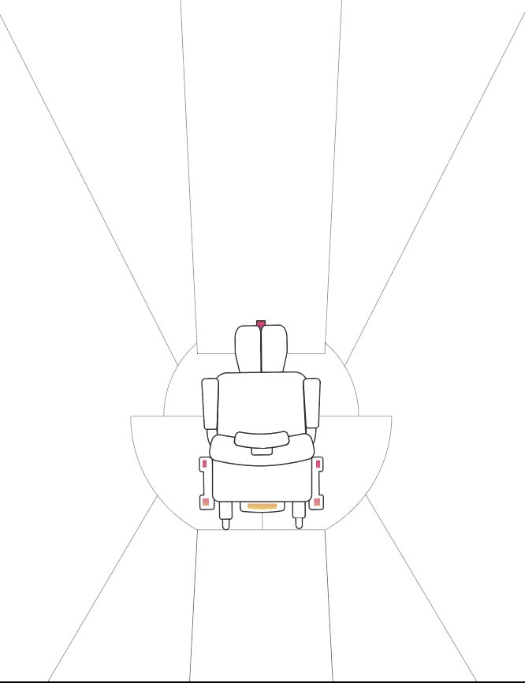

# luci_messages

## summary:

This is a custom message package for message types that are LUCI specific.

| Package | Message |
|---------|---------|
| luci_messages | LuciJoystick    `int32 forward_back`   `int32 left_right` |
|  | LuciScaling    `float front_fb`   `float front_rl`   `float front_right_fb`   `float front_right_rl`   `float front_left_fb`   `float front_left_rl`   `float right_fb`   `float right_rl`   `float left_fb`   `float left_rl`   `float back_right_fb`   `float back_right_rl`   `float back_left_fb`   `float back_left_rl`   `float back_fb`   `float back_rl`   `uint32 max_js_scale_increase`   `uint32 max_js_scale_decrease`   `bool luci_active` |
|  | LuciDriveMode    `enum drive_mode` |

The luci scaling zones message is based on grouping scaling into 8 zones each is split into a forward back and a left and right value. This indicates the percent scaling that would be applied to a joysticks (forward back, left right) values if placed in one of the 8 zones. See the image below for the configuration of the 8 zones.

