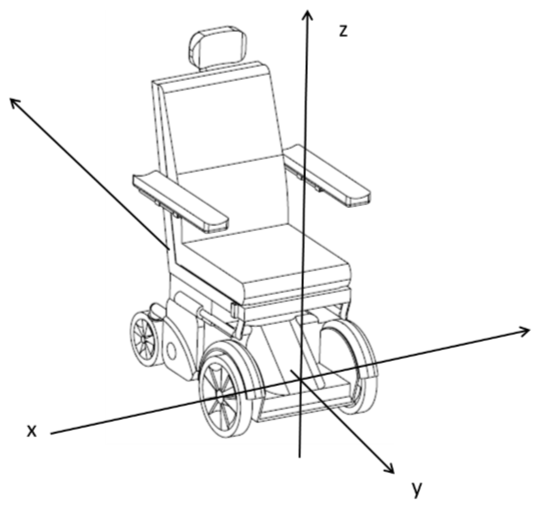

# luci_transforms

## summary

This package handles the transformation of raw sensor points that are all referenced at sensor origin to a common chair center origin.

This package should only be needed if using the gRPC node to get LUCI transformed pointclouds into a ROS2 base_link compatible frame. This node essentially switches which axis is in the front of the chair since LUCI has Y axis in front and
standard base_link has X axis in front. 

If using a simulation with a URDF that includes accurate LUCI sensor placement and robot_description node this node should not be ran. In addition if the gRPC node is ever altered to produce the raw sensor streams (that is to say data that has not already
been transformed by LUCI to be relative to its center of chair frame) then these transforms will no longer be valid.

_**Note: All the sensors from LUCI streams are conveniently  already set relative to the chair center so the transforms below are an identity matrix that is only here to provide other tools such as nav\_2 and rviz2 with knowledge of the frames used**_

| Package | Node |
|---------|------|
| luci_transforms | permobil_m3_tf_node |
| luci_transforms | quickie_500m_tf_node |

| Topics | Subscription / Publish | Message Type | Description |
|--------|------------------------|--------------|-------------|
| tf/ | publish | geometry_msgs::msg::TransformStamped | Transformations from (base_camera, base_radar, base_ultrasonic, base_footprint) to base_link (chair center)    (base_link = chair center, base_camera = camera stream, base_radar = radar stream, base_ultrasonic = ultrasonic stream, base_footprint = 2D center of chair) |

**Note chair center is defined as the center of the drive wheels and is the 0 point for all sensor streams from LUCI. See image below for reference.**

Post transform a obstacle 1m in front of the chair in its Y axis will be 1m on the X axis of base_link and base_footprint frame. This is to align with the standard ROS base_link frame and right hand rule.

