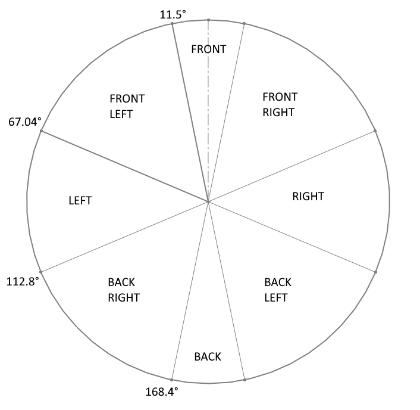
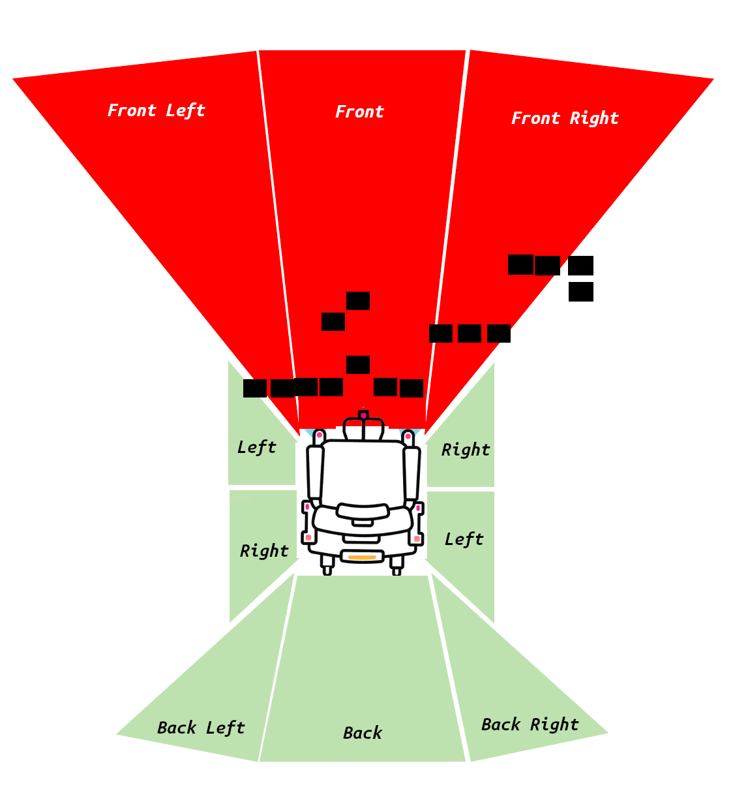

# luci_messages

## summary:

This is a custom message package for message types that are LUCI specific.

| Package | Message |
|---------|---------|
| luci_messages | LuciJoystick    `int32 forward_back`   `int32 left_right` |
|  | LuciScaling    `float front_fb`   `float front_rl`   `float front_right_fb`   `float front_right_rl`   `float front_left_fb`   `float front_left_rl`   `float right_fb`   `float right_rl`   `float left_fb`   `float left_rl`   `float back_right_fb`   `float back_right_rl`   `float back_left_fb`   `float back_left_rl`   `float back_fb`   `float back_rl`   `uint32 max_js_scale_increase`   `uint32 max_js_scale_decrease`   `bool luci_active` |
|  | LuciDriveMode    `enum`    `USER=1 ENGAGED=2 AUTO=3` |

The LUCI scaling zones message is based on the on the chair scaling LUCI uses. Scaling is broken up into 8 zones seen below. In each zone there also exists a scaling for forward/back and left/right. LUCI determines which zone the joystick is currently in based on the angle of the joystick per the image below. This indicates the percent scaling that would be applied to a joysticks (forward back, left right) values if placed in one of the 8 zones.

For example if the joystick was at an angle of 5 degrees from center (placing it in the front zone) and LUCI had a front_fb scaling value of 0.5 and a front_rl scaling value of 1.0 then LUCI would scale the joystick in the Y axis by 50% and would let 100% scaling in the x axis (relative to chair coordinates)

