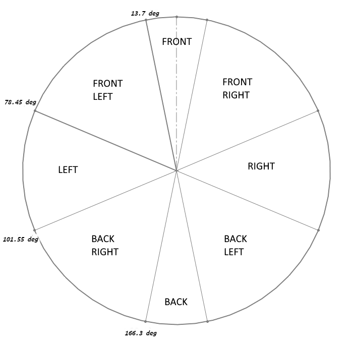

# luci_messages

## Summary:

This is a custom message package for message types that are LUCI specific.

| Luci Messages     | Message Details                                                                                                                                                                                                                                                                                                                                                                                                                                                                                                                                                                                                                                                                                                                                                                                                                      |
| ------------- | ---------------------------------------------------------------------------------------------------------------------------------------------------------------------------------------------------------------------------------------------------------------------------------------------------------------------------------------------------------------------------------------------------------------------------------------------------------------------------------------------------------------------------------------------------------------------------------------------------------------------------------------------------------------------------------------------------------------------------------------------------------------------------------------------------------------------------- |
| LuciJoystick |  `int32 forward_back`   `int32 left_right`   `int32 joystick_zone`   `int32 input source`                                                                                                                                                                                                                                                                                                                                                                                                                                                                                                                                                                                                                                                                                                                           |
|     LuciJoystickScaling          |  `int32 forward_back (scaled forward back limit)`   `int32 left_right (scaled left right limit)`   `int32 joystick_zone`   `int32 input_source`   `float32 forward_back_scaling`   `float32 left_right_scaling`                                                                                                                                                                                                                                                                                                                                                                                                                                                                                                                                                                                                                                                              |
|     LuciZoneScaling          |   `float32 front_fb`   `float32 front_rl`   `float32 front_right_fb`   `float32 front_right_rl`   `float32 front_left_fb`   `float32 front_left_rl`   `float32 right_fb`   `float32 right_rl`   `float32 left_fb`   `float32 left_rl`   `float32 back_right_fb`   `float32 back_right_rl`   `float32 back_left_fb`   `float32 back_left_rl`   `float32 back_fb`   `float32 back_rl`                                                                                                                                                                                                                                                                                  |
|       LuciImu        |  `std_msgs/Header header`   `float32 quaternion_x`   `float32 quaternion_y`   `float32 quaternion_z`   `float32 quaternion_w`   `float32 acceleration_x`   `float32 acceleration_y`   `float32 acceleration_z`   `float32 gyro_x`   `float32 gyro_y`   `float32 gyro_z`   `float32 euler_x`   `float32 euler_y`   `float32 euler_z`   `float32 accelerometer_x`   `float32 accelerometer_y`   `float32 accelerometer_z`   `float32 magnetometer_x`   `float32 magnetometer_y`   `float32 magnetometer_z`   `float32 gravity_x`   `float32 gravity_y`   `float32 gravity_z`   `int32 cal_system`   `int32 cal_gyroscope`   `int32 cal_accelerometer`   `int32 cal_magnetometer`   `int32 source`   `uint32 edge_timestamp` |
|         LuciEncoders      | `float32 left_angle`   `float32 right_angle`   `float32 fl_caster_degrees`   `float32 bl_caster_degrees`   `float32 fr_caster_degrees`   `float32 br_caster_degrees`   `uint32 edge_timestamp`                                                                                                                                                                                                                                                                                                                                                                                                                                                                                                                                                                                                                        |
|      LuciCameraInfo         |  `float32[4] intrinsics (fx,fy,ppx,ppy)`   `float32[3] translation (x,y,z meters camera->chair center)`   `float32[3] rotation (x,y,z radians) camera -> chair center`   `enum type RADIAN=0 DEGREE=1`                                                                                                                                                                                                                                                                                                                                                                                                                                                                                                                                                                                    |

The LUCI scaling zones message is based on the on the chair scaling LUCI uses. Scaling is broken up into 8 zones seen below. In each zone there also exists a scaling for forward/back and left/right. LUCI determines which zone the joystick is currently in based on the angle of the joystick per the image below. This indicates the upper limit the joystick would be allowed to be (forward back, left right) if the joystick is placed in one of the 8 zones.

For example if the joystick was at an angle of 5 degrees from center (placing it in the front zone) and LUCI had a front_fb scaling value of 0.5 and a front_rl scaling value of 1.0 then LUCI would allow the max joystick in the Y axis to be +/- 50 (or 50% of full throw) and would let the max js in the x axis to be +/- 100 (or 100% of full throw) (relative to chair coordinates).

For the encoder data stream the `edge_timestamp` is expected to be a constant timer from the encoder or processing board's clock. Ideally this clock is produced from as close to the source of the readings as possible. For example with the encoder setup described here https://github.com/lucimobility/luci-sdk-encoders the edge_timestamp will be the milliseconds since the arduino control board booted up. This is using the [millis()](https://www.arduino.cc/reference/en/language/functions/time/millis/) call in arduino. 

<b>Note:</b>

The LuciJoystickScaling message has the joystick values with the LUCI scaling applied as well as the scaling applied. These are the values most recently used to control the chair and have already been sent to the wheelchairs drive controller. Please note this message also contains the scaling zone that was used for these outputs.

Input source parameter is added to LuciJoystick and LuciJoystickScaling. This parameter denotes which input source has been set by the user. If this is used in any place to send commands to LUCI, make sure it is set to the same input as the desired/set state on LUCI or LUCI will disregard the command.

The input source are mapped as following:

| Integer | Input Source      |
| ------- | ----------------- |
|    0    |  RampAssist       |
|    1    |  AutonomousRemote |
|    2    |  WDI              |
|    3    |  ChairVirtual     |
|    4    |  ChairPhysical    |
|    5    |  SharedRemote     |

The joystick zones are mapped as following:

| Integer | Joystick Zone   |
| ------- | --------------- |
|    0    |  Front          |
|    1    |  FrontLeft      |
|    2    |  FrontRight     |
|    3    |  Left           |
|    4    |  Right          |
|    5    |  BackLeft       |
|    6    |  BackRight      |
|    7    |  Back           |
|    8    |  Origin         |

The LuciJoystick message also has the LUCI scaling zone that the input JS would fall in.

